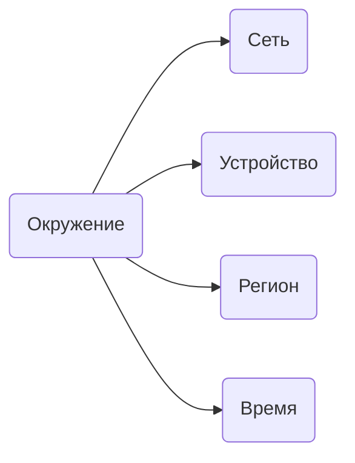

## Что такое окружение

Окружение это всё, что Telegram видит при подключении: сеть, устройство, регион, время. Эти параметры формируют контекст сессии.

<CardGroup cols={2}>

<Card title="Сеть" icon="wifi">
  - IP-адрес
  - Провайдер
  - Тип подключения
</Card>

<Card title="Устройство" icon="smartphone">
  - Операционная система
  - Модель
  - Версия клиента
</Card>

<Card title="Регион" icon="map-pin">
  - Страна
  - Город
  - Геолокация IP
</Card>

<Card title="Время" icon="clock">
  - Временная зона
  - Часы активности
</Card>

</CardGroup>

## Согласованность

Telegram сравнивает все параметры между собой. Если они указывают на один регион, всё хорошо. Если противоречат, появляются вопросы.

| Ситуация | Пример | Риск |
|----------|--------|------|
| Всё совпадает | Номер +7, IP из России, время MSK | Минимальный |
| Небольшое отклонение | Номер +7, IP из России, язык английский | Низкий |
| Разные регионы | Номер +7, IP из США | Высокий |
| Телепортация | Москва в 10:00, Токио в 10:05 | Критический |

<Note>
Ключевой фактор это правдоподобность. Постепенное перемещение из России в Германию за неделю нормально. Скачок за 5 минут уже нет.
</Note>

## Что настраивать

Перед входом в аккаунт проверьте:

| Параметр | Что нужно |
|----------|-----------|
| IP-адрес | Из региона номера телефона. |
| Тип IP | Качественный прокси (не VPN). |
| Временная зона | Соответствует региону IP. |
| Язык системы | Желательно соответствует региону. |

<Warning>
Если IP плохой (датацентр, известный VPN, в блэклистах), Telegram может потребовать покупку Premium для продолжения. Это сигнал сменить прокси.
</Warning>

## Device ID

Device ID это уникальный идентификатор устройства. Telegram присваивает его при первом входе на основе характеристик: модели, ОС, версии клиента.

### Что Telegram проверяет

- Входили ли с этого устройства раньше.
- В какие ещё аккаунты входили с этого устройства.
- Как часто меняются аккаунты.

### Почему это важно

Много аккаунтов с одного Device ID = признак мультиаккаунтинга. То же самое с IP: если несколько аккаунтов используют один прокси, Telegram связывает их между собой.

Последствия:

- Частые запросы верификации.
- Ограничения функций.
- Блокировка аккаунтов.
- Проблема с одним аккаунтом затрагивает остальные.

<Note>
Разные аккаунты — разные прокси. Использовать один прокси для нескольких аккаунтов рискованно.
</Note>

### Лимиты

<Note>
Максимум 5 аккаунтов на одно устройство. Активность со всех суммируется: проблема с одним аккаунтом влияет на траст остальных.
</Note>

| Количество | Комментарий |
|------------|-------------|
| 1-2 аккаунта | Безопасно. |
| 3-4 аккаунта | Допустимо, но траст ниже. |
| 5 аккаунтов | Максимум. Проблема с одним затронет все. |

### Как сбросить Device ID

Простая переустановка Telegram не сбрасывает Device ID. Он формируется из комбинации:

- Идентификаторов железа.
- Параметров ОС.
- Данных клиента.

Для смены нужно менять окружение целиком: другое устройство, виртуальная машина или отдельный профиль.

## Следующие шаги

<CardGroup cols={2}>

<Card title="Прокси" icon="globe" color="#6b7280" href="/network/proxy" arrow="true">
  Как выбрать и настроить прокси.
</Card>

<Card title="Решение проблем" icon="circle-alert" color="#6b7280" href="/issues/troubleshooting" arrow="true">
  Что делать при проблемах с окружением.
</Card>

</CardGroup>
