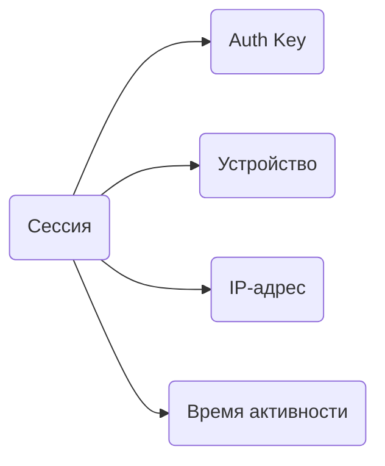
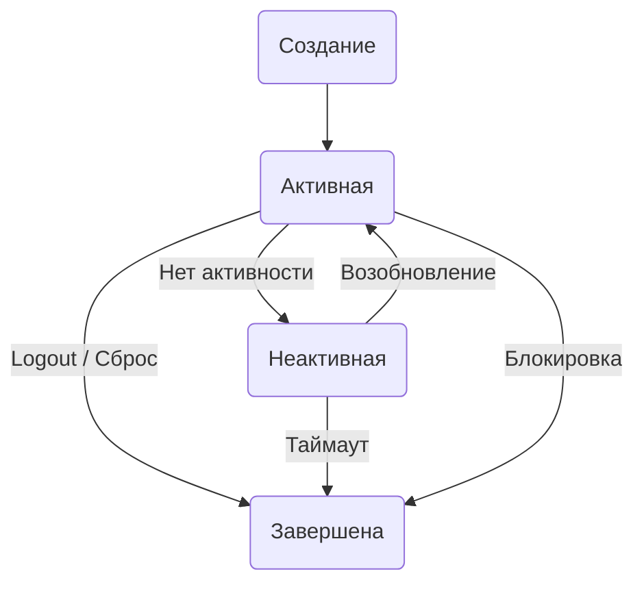

## Что такое сессия

Сессия — это авторизованное подключение к аккаунту с конкретного устройства. Когда вы входите в Telegram, создаётся сессия, которая позволяет пользоваться аккаунтом без повторного ввода кода.

Один аккаунт может иметь несколько активных сессий: телефон, компьютер, веб-версия.

## Из чего состоит сессия

Каждая сессия содержит:

- **Auth Key** — криптографический ключ для шифрования трафика. Генерируется один раз при создании сессии.
- **Device Info** — информация об устройстве (модель, ОС, версия клиента).
- **IP-адрес** — адрес, с которого создана сессия и последняя активность.
- **Время** — когда создана и когда была последняя активность.

<Note>
Auth Key — это главное. Кто владеет ключом, тот контролирует сессию. Именно поэтому сессионные файлы (.session) нужно хранить в безопасности.
</Note>

## Жизненный цикл

**Создание** — вы вводите номер, получаете код, входите. Telegram создаёт сессию.

**Активная** — сессия работает, вы пользуетесь аккаунтом.

**Неактивная** — вы давно не заходили. Сессия ещё жива, но Telegram может её завершить через несколько месяцев.

**Завершена** — сессия больше не работает. Нужна повторная авторизация.

## Почему сессия может слететь

| Причина | Что происходит |
|---------|----------------|
| Вы нажали "Завершить сессию" | Сессия закрывается. |
| Сбросили все сессии | Все устройства разлогиниваются. |
| Telegram обнаружил аномалию | Резкая смена IP/региона, подозрительная активность. |
| Долго не пользовались | Telegram завершает неактивные сессии (обычно через 6 месяцев). |
| Аккаунт заблокирован | Все сессии завершаются. |

## Где посмотреть сессии

В Telegram: **Настройки → Устройства** (или **Настройки → Конфиденциальность → Активные сессии**).

Там видно:

- Все активные сессии.
- Устройство и IP каждой сессии.
- Когда была последняя активность.

Оттуда же можно завершить любую сессию или все сразу.

## Несколько сессий одновременно

Telegram разрешает несколько активных сессий. Это нормально:

- Основной телефон.
- Рабочий компьютер.
- Планшет.

Но если сессий слишком много или они из разных стран одновременно — это вызывает подозрения.

<Note>
Сессии независимы друг от друга. Если одну завершили или заблокировали, остальные продолжают работать.
</Note>

## Следующие шаги

<CardGroup cols={2}>

<Card title="Окружение" icon="globe" color="#6b7280" href="/accounts/env" arrow="true">
  Как IP и регион влияют на сессию.
</Card>

<Card title="Решение проблем" icon="triangle-alert" color="#6b7280" href="/issues/troubleshooting" arrow="true">
  Что делать, если сессия слетела.
</Card>

</CardGroup>
