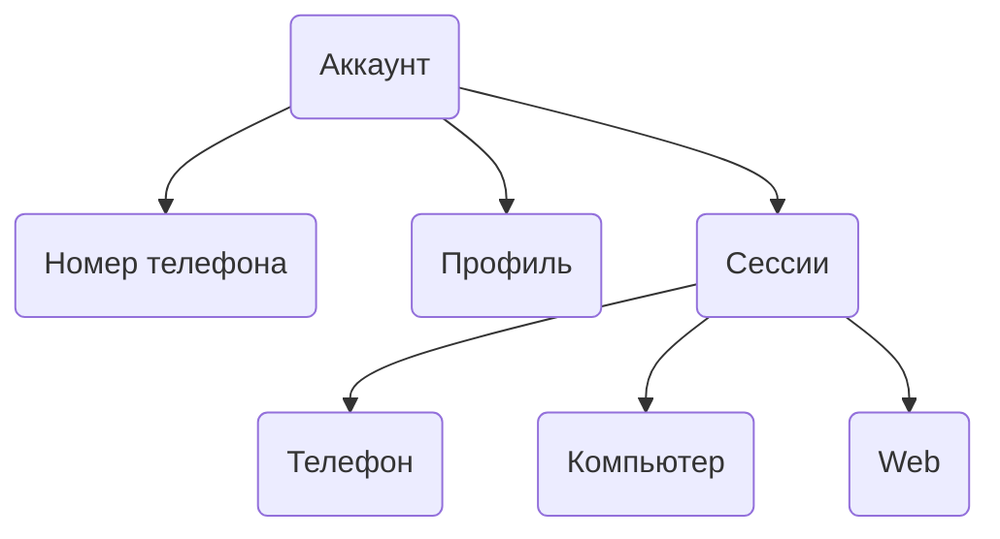

## Как устроен аккаунт

Telegram-аккаунт — это не просто логин и пароль. Это связка из нескольких компонентов:

## Номер телефона

Номер — это главный идентификатор аккаунта. Он используется для:

- Входа в аккаунт.
- Получения кодов подтверждения.
- Восстановления доступа.

Код страны в номере (+7, +1, +49) также определяет "домашний" регион аккаунта. Telegram ожидает, что активность будет преимущественно из этого региона.

## Профиль

Профиль — это публичная часть аккаунта:

- Имя и фамилия.
- Юзернейм (@username).
- Фото.
- Био.

Профиль можно менять без последствий для безопасности аккаунта.

## Сессии

Сессия создаётся каждый раз, когда вы входите в аккаунт с нового устройства. Один аккаунт может иметь несколько активных сессий одновременно.

Каждая сессия привязана к:

- Устройству (модель, ОС).
- IP-адресу.
- Клиенту Telegram (версия, платформа).

Telegram отслеживает все сессии. Посмотреть их можно в настройках: **Настройки → Устройства**.

## Device ID

Каждое устройство получает уникальный идентификатор — Device ID. Telegram запоминает, с каких устройств входили в аккаунт.

Почему это важно: если с одного устройства входят в много разных аккаунтов, Telegram видит это и расценивает как подозрительную активность. Результат — проверки, ограничения или блокировки.

<Note>
**Правило:** максимум 5 аккаунтов на устройство, но чем меньше — тем лучше. Активность со всех аккаунтов суммируется, и проблема с одним влияет на траст остальных.
</Note>

Подробнее о Device ID и настройке окружения — в разделе [Окружение](/accounts/env).

## Что важно понимать

<CardGroup cols={3}>

<Card title="Номер = аккаунт" icon="phone">
  Потеря доступа к номеру означает потерю аккаунта.
</Card>

<Card title="Сессии независимы" icon="layers">
  Проблема с одной сессией не влияет на другие.
</Card>

<Card title="Регион важен" icon="map-pin">
  Telegram сравнивает код страны номера с геолокацией IP.
</Card>

</CardGroup>

## Следующие шаги

<CardGroup cols={2}>

<Card title="Сессии" icon="key" color="#6b7280" href="/accounts/sessions" arrow="true">
  Подробнее о том, как работают сессии.
</Card>

<Card title="Окружение" icon="globe" color="#6b7280" href="/accounts/env" arrow="true">
  Как настроить IP и регион.
</Card>

</CardGroup>
