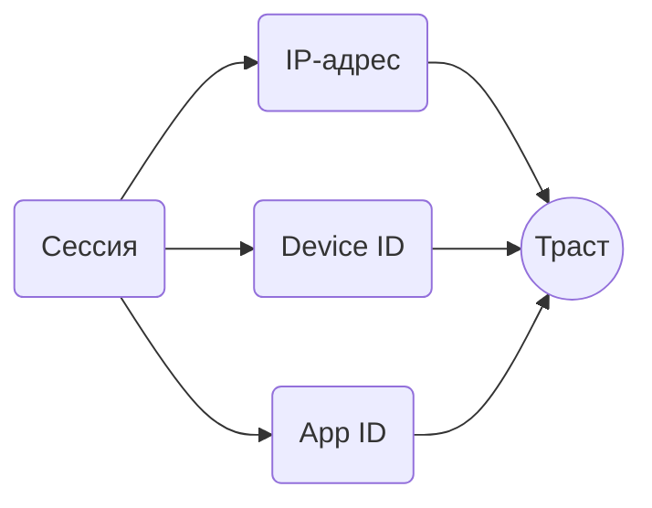

## Что это такое

Каждое приложение, работающее с Telegram API, имеет пару идентификаторов: **App ID** (число) и **API Hash** (строка). Telegram видит их при каждом подключении и учитывает в оценке сессии.

## Откуда берутся ключи

### Официальные клиенты

Ключи можно извлечь из исходного кода или бинарников популярных клиентов:

| Клиент | Источник | Особенности |
|--------|----------|-------------|
| Telegram Desktop | Открытый исходный код | Самые «чистые», миллионы пользователей |
| Telegram Android | Открытый исходный код | Хорошая репутация |
| Telegram iOS | Открытый исходный код | Хорошая репутация |
| Telegram macOS | Открытый исходный код | Меньше пользователей |

Ключи официальных клиентов имеют лучшую репутацию, потому что ими пользуются обычные люди для обычного общения.

### Библиотеки

Популярные библиотеки поставляются со встроенными ключами:

| Библиотека | Ситуация |
|------------|----------|
| Telethon | Встроенные ключи, используются по умолчанию |
| Pyrogram | Встроенные ключи, используются по умолчанию |
| TDLib | Требует указать свои |

**Проблема:** встроенные ключи библиотек публичны. Их использует огромное количество людей с разными целями, включая спамеров. Репутация таких ключей ниже, чем у ключей официальных клиентов.

### Собственные

Можно создать на my.telegram.org. Свежие ключи не имеют истории, что может быть как плюсом (нет негатива), так и минусом (нет позитива).

## Как App ID влияет на траст

App ID участвует в формировании доверия к сессии наравне с IP и Device ID.

Telegram накапливает статистику по каждому App ID:
- Сколько аккаунтов его использует
- Какой процент получал спамблоки
- Были ли массовые жалобы
- Характер активности

## Интересные детали

### Платформа должна совпадать

При создании App ID указывается платформа: Android, iOS, Desktop, Web. Telegram сверяет заявленную платформу с фактическими данными сессии.

Несоответствие вызывает подозрения:
- App ID с платформой «iOS», но User-Agent от Android
- App ID «Desktop», но мобильный fingerprint

Поэтому если извлекаете ключи из клиента, используйте их на соответствующей платформе.

### Связь с создателем

App ID навсегда привязан к аккаунту, который его создал. Если аккаунт-создатель заблокирован за серьёзные нарушения, это может повлиять на репутацию всех его App ID.

### Паттерны использования

Telegram видит, сколько разных аккаунтов использует один App ID. Само по себе это нормально (официальные клиенты так и работают), но в сочетании с другими факторами учитывается.

«Один App ID + один IP + много аккаунтов» подозрительнее, чем «официальный App ID + разные IP + много аккаунтов».

## Что выбрать

<CardGroup cols={2}>
<Card title="Ключи официальных клиентов" icon="check" color="#22c55e">
Лучший выбор для большинства случаев. Высокая репутация, соответствие платформе.
</Card>

<Card title="Встроенные в библиотеки" icon="minus" color="#6b7280">
Работают, но репутация хуже. Подходит, если нет проблем.
</Card>

<Card title="Собственные" icon="plus" color="#6b7280">
Чистая история. Имеет смысл для крупных проектов.
</Card>

<Card title="Чужие из интернета" icon="ban" color="#ef4444">
Не используйте. Неизвестная история, возможно скомпрометированы.
</Card>
</CardGroup>

## Приоритет факторов

App ID важен, но не определяющий:

1. **IP-адрес** — самый важный фактор
2. **История аккаунта** — предыдущие нарушения
3. **Device ID** — связь с другими аккаунтами
4. **App ID** — дополнительный сигнал

Хороший IP и чистая история перевешивают не лучший App ID. Но при прочих равных лучше использовать ключи официальных клиентов.
