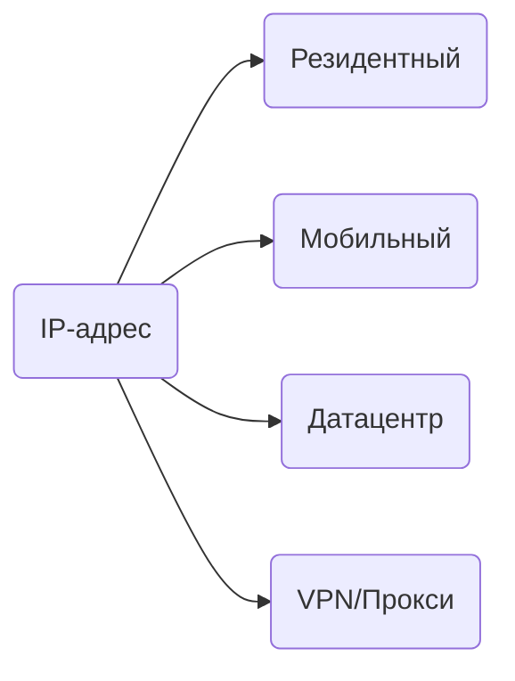

## Что анализирует Telegram

При каждом подключении Telegram видит:

- **IP-адрес** и его геолокацию.
- **Тип сети** (домашний провайдер, мобильный оператор, датацентр).
- **Репутацию IP** (есть ли в чёрных списках).
- **Историю изменений** (как часто меняется IP).

## Типы IP-адресов

### Резидентный IP

IP от домашнего интернет-провайдера. Выдаётся обычным пользователям.

| Параметр | Значение |
|----------|----------|
| Траст | Высокий |
| Доступность | Сложно получить |
| Стоимость | Высокая |

Это лучший вариант для работы с аккаунтами.

### Мобильный IP

IP от мобильного оператора. Часто используется многими пользователями одновременно (CGNAT).

| Параметр | Значение |
|----------|----------|
| Траст | Средний-высокий |
| Доступность | Через мобильные прокси |
| Стоимость | Средняя |

Хороший вариант, особенно для аккаунтов с мобильными номерами.

### Датацентр

IP от хостинг-провайдеров и облачных сервисов.

| Параметр | Значение |
|----------|----------|
| Траст | Низкий |
| Доступность | Легко |
| Стоимость | Низкая |

Telegram легко определяет такие IP и относится к ним с подозрением.

### VPN-сервисы

IP популярных VPN-провайдеров.

| Параметр | Значение |
|----------|----------|
| Траст | Очень низкий |
| Доступность | Легко |
| Стоимость | Низкая |

Большинство IP известны Telegram и находятся в чёрных списках. [Почему VPN не подходит](/network/vpn).

## Что важно

<CardGroup cols={2}>

<Card title="Регион = номер" icon="map-pin">
  IP должен быть из того же региона, что и номер телефона аккаунта.
</Card>

<Card title="Стабильность" icon="anchor">
  Частая смена IP вызывает подозрения. Один IP надолго лучше, чем разные каждый день.
</Card>

<Card title="Репутация" icon="shield-check">
  IP не должен быть в чёрных списках или помечен как прокси/VPN.
</Card>

<Card title="Один IP = один аккаунт" icon="user">
  Использование одного IP для нескольких аккаунтов связывает их между собой.
</Card>

</CardGroup>

## Допустимые сценарии

| Ситуация | Риск |
|----------|------|
| Стабильный IP из региона номера | Минимальный |
| Смена IP в пределах одного провайдера | Низкий |
| Смена города в пределах страны | Низкий |
| Смена страны (постепенно) | Средний |
| Частая смена IP | Высокий |
| Телепортация (Москва → Токио за 5 минут) | Критический |

<Note>
Ключевой фактор это правдоподобность. Изменения должны выглядеть как естественное поведение обычного пользователя.
</Note>

## Следующие шаги

<CardGroup cols={2}>

<Card title="Почему не VPN" icon="shield-off" color="#6b7280" href="/network/vpn" arrow="true">
  Почему VPN не подходит для работы с аккаунтами.
</Card>

<Card title="Прокси" icon="globe" color="#6b7280" href="/network/proxy" arrow="true">
  Как выбрать и настроить прокси.
</Card>

</CardGroup>
