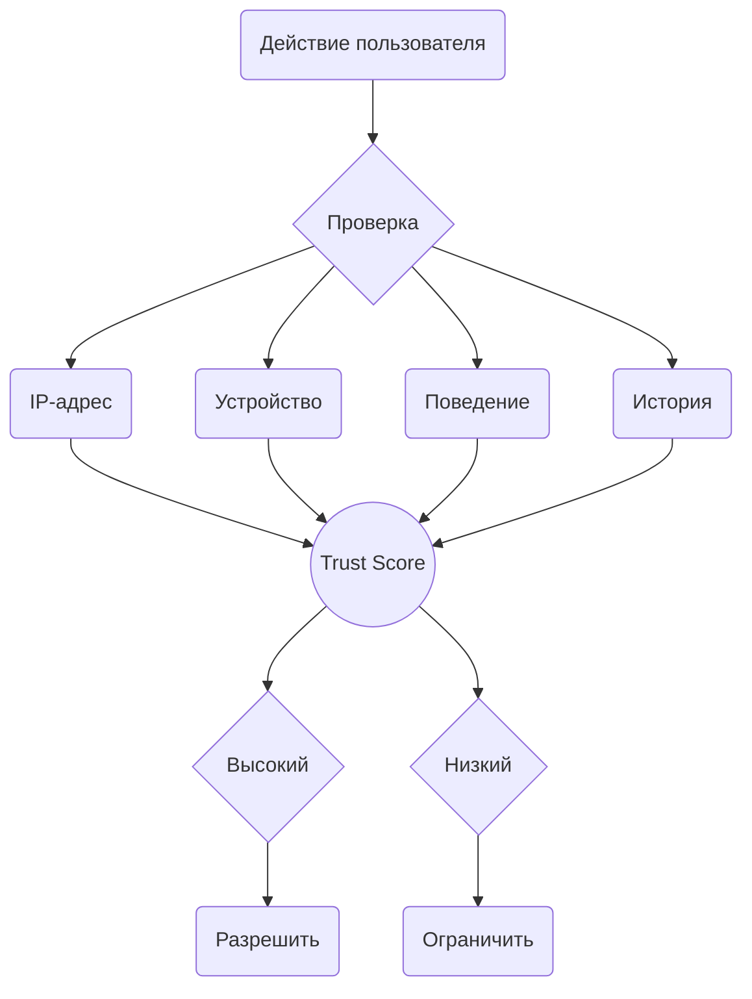

## Главное — установите 2FA

<Warning>
**Это первое, что нужно сделать после входа в аккаунт.**

Аккаунты зарегистрированы на виртуальные номера. Недобросовестные SMS-провайдеры могут перепродать номер повторно. Тогда новый владелец получит код и войдёт в ваш аккаунт.

2FA защищает от этого: даже с кодом из SMS войти без пароля не получится.
</Warning>

### Как установить

<Steps>
<Step title="Откройте настройки">
В Telegram перейдите в **Настройки**.
</Step>

<Step title="Конфиденциальность">
Выберите **Конфиденциальность**.
</Step>

<Step title="Двухэтапная аутентификация">
Нажмите **Двухэтапная аутентификация** и установите пароль.
</Step>

<Step title="Сохраните пароль">
Запишите пароль в надёжное место. Если забудете, восстановить доступ будет сложно.
</Step>
</Steps>

<Note>
Можно добавить email для восстановления, но это необязательно. Главное — сам пароль.
</Note>

## Trust Score

Telegram ведёт внутренний рейтинг доверия для каждого аккаунта. Официально он не раскрывается, но поведение системы явно указывает на его существование.

### Что повышает траст

- Возраст аккаунта
- Стабильное окружение (один IP, одно устройство)
- Отсутствие жалоб
- 2FA включена
- Естественные паттерны активности
- Постепенный «прогрев» после покупки

### Что снижает траст

- Новый аккаунт без истории
- Жалобы от пользователей
- Спамблоки и ограничения в истории
- Частая смена IP или устройства
- Массовые действия (рассылки, инвайты)
- Несоответствие региона IP и номера

### Последствия низкого траста

При низком trust score Telegram:

- Устанавливает более строгие лимиты
- Чаще запрашивает верификацию
- Быстрее выдаёт спамблоки
- Может требовать Premium для входа с плохого IP

## Как Telegram следит за аккаунтами

Telegram анализирует каждое действие в контексте:

- **IP** — тип, регион, репутация
- **Устройство** — Device ID, сколько аккаунтов с него входило
- **Поведение** — частота, типы действий, время
- **История** — были ли проблемы раньше

## Базовые правила

<CardGroup cols={2}>

<Card title="Стабильность" icon="anchor">
Не меняйте IP, устройство и регион без необходимости. Каждое изменение — сигнал для Telegram.
</Card>

<Card title="Постепенность" icon="trending-up">
Новый аккаунт должен «прогреться». Начинайте с минимальной активности, наращивайте постепенно.
</Card>

<Card title="Естественность" icon="user">
Действуйте как обычный пользователь. Паузы между сообщениями, разнообразие действий, человеческий ритм.
</Card>

<Card title="Внимание к сигналам" icon="bell">
FLOOD_WAIT, запросы верификации, спамблоки — это предупреждения. Реагируйте сразу.
</Card>

</CardGroup>

## Чего избегать

- **Массовые действия** — рассылки, инвайты, добавление контактов пачками
- **Резкие изменения** — смена IP посреди сессии, переезд между регионами
- **Игнорирование лимитов** — повторные запросы после FLOOD_WAIT
- **Плохие IP** — VPN, датацентры, IP из блэклистов

## Неочевидные вещи

**Первые 48 часов.** Нарушение на новой сессии весит в разы больше. Первые два дня лучше просто пользоваться аккаунтом без активных действий.

**Premium.** Спамер не платит за подписку. Telegram это понимает и даёт Premium-аккаунтам больше свободы.

**Тихий бан.** Сообщения уходят, но не доходят. Вы этого не видите. Если вам перестали отвечать, проверьте @SpamBot.

**Timezone.** Немецкий прокси + московское время = несоответствие. Telegram это видит.

**Пустой профиль.** Без фото и bio аккаунт выглядит как спам-болванка. Но не заполняйте сразу — дайте аккаунту отлежаться 3-5 дней, потом добавьте фото и bio.

**Username с историей.** Если username раньше был у забаненного аккаунта, часть репутации может перейти к вам.

**Социальный граф.** Ваш номер в контактах у спамеров — минус. В контактах у нормальных аккаунтов — плюс.

**Скорость печати.** Когда вы печатаете, клиент отправляет статус «печатает...» на сервер. Telegram видит интервалы между символами, паузы, исправления. Человек печатает неравномерно, бот — равномерно или вставляет текст мгновенно. Сообщение без typing-статуса или typing 0.1 сек → длинный текст = автоматизация.

## Подробнее

<CardGroup cols={2}>

<Card title="Окружение" icon="settings" color="#6b7280" href="/accounts/env" arrow="true">
Device ID, лимиты аккаунтов, настройка окружения.
</Card>

<Card title="Прокси" icon="globe" color="#6b7280" href="/network/proxy" arrow="true">
Как выбрать прокси, почему не VPN.
</Card>

<Card title="Решение проблем" icon="triangle-alert" color="#6b7280" href="/issues/troubleshooting" arrow="true">
Что делать при спамблоках и ограничениях.
</Card>

<Card title="Активация аккаунта" icon="play" color="#6b7280" href="/getting-started/first-steps" arrow="true">
Первые шаги после покупки.
</Card>

</CardGroup>
